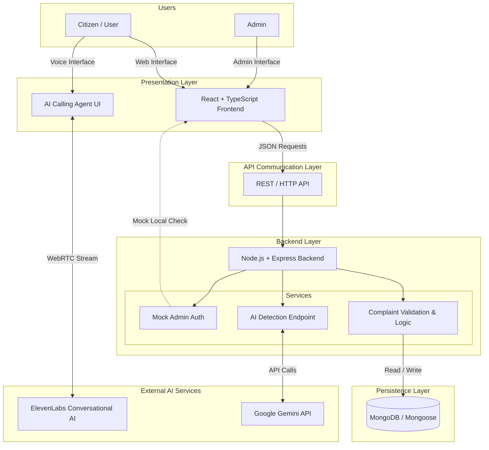
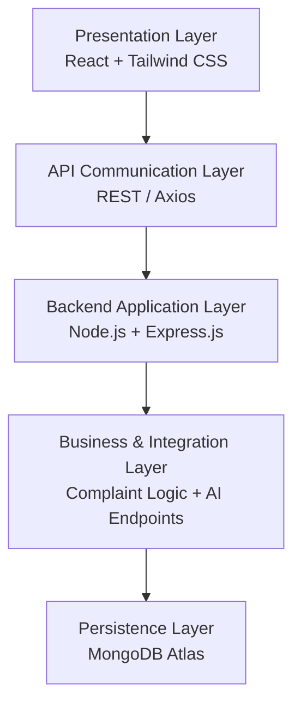
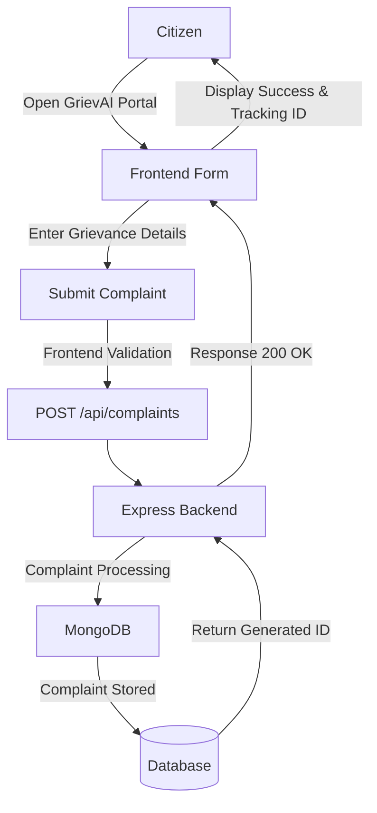
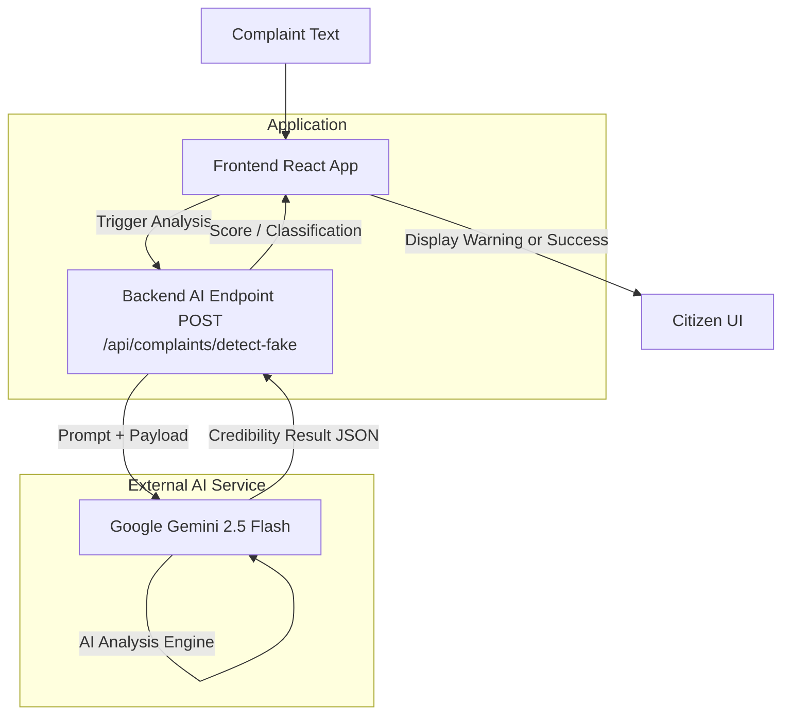
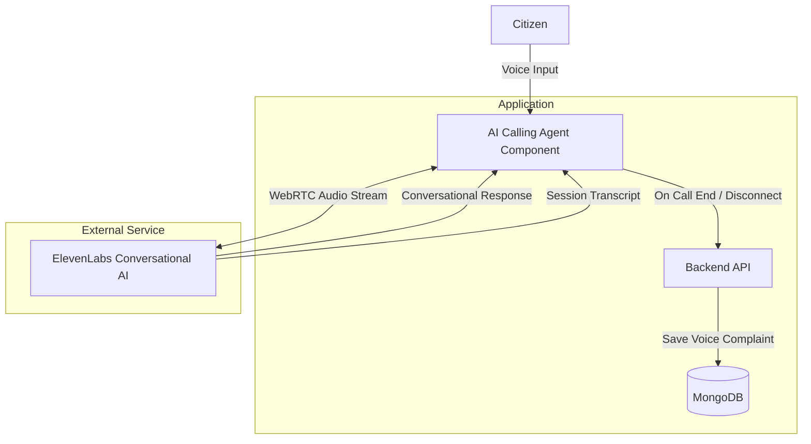
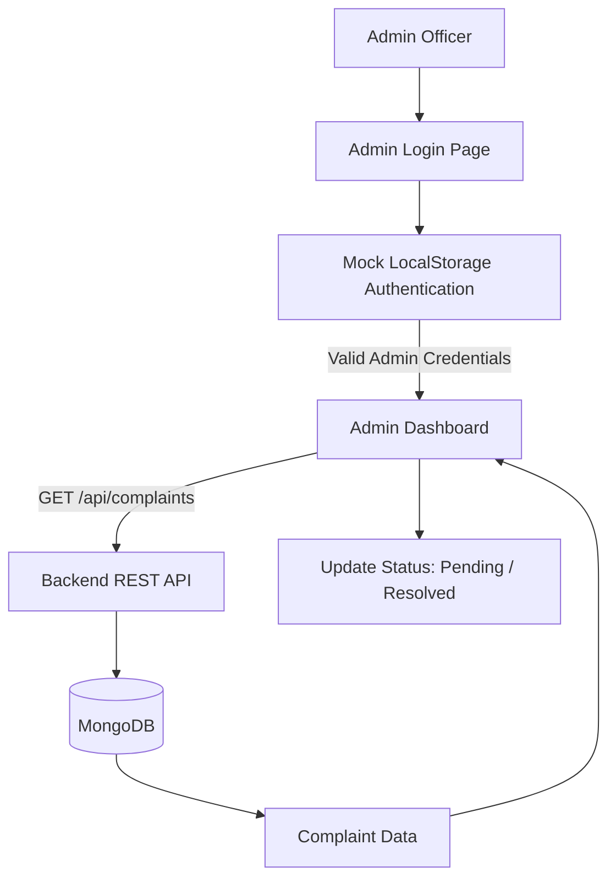
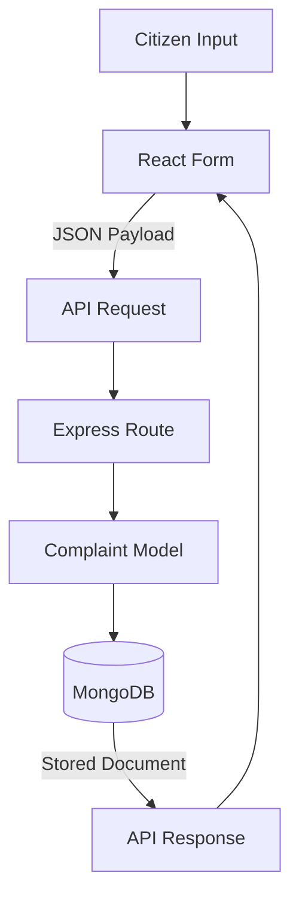
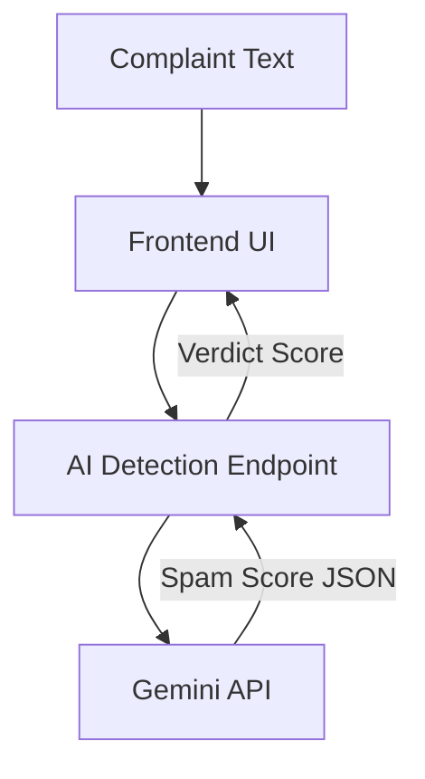
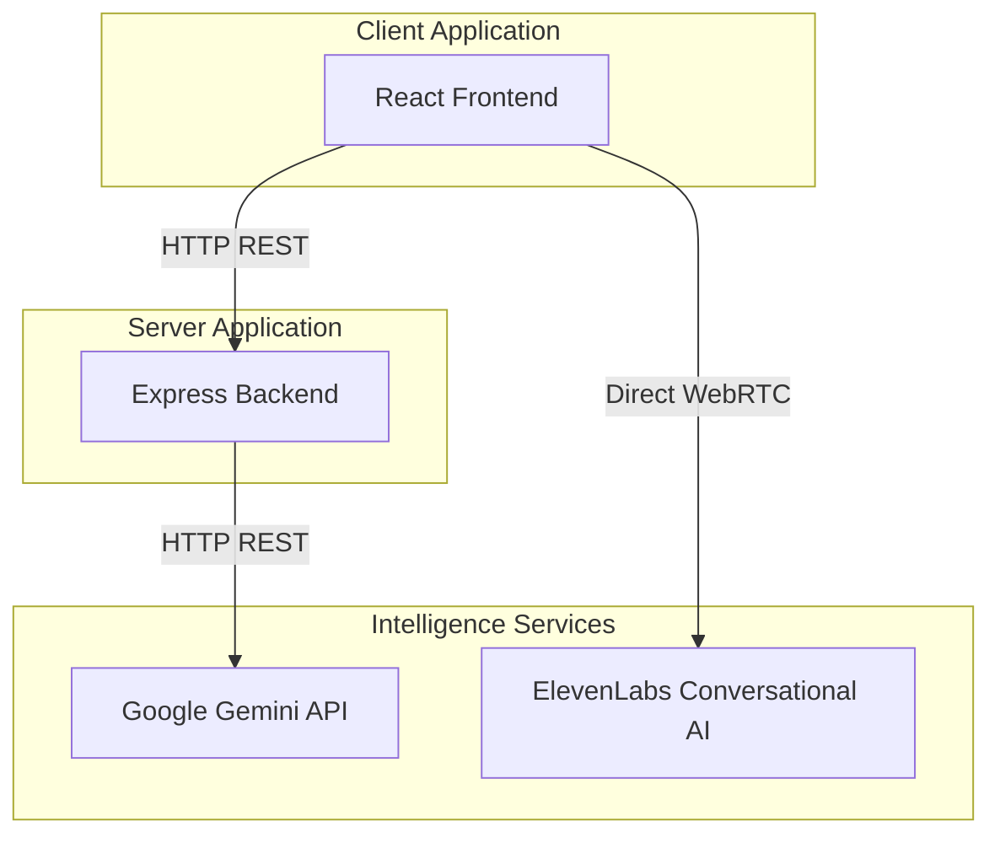

# AI-Grievance-Redressal Portal

### GrievAI

GrievAI is a modern, full-stack government and civic grievance management platform. It streamlines the entire complaint lifecycle by providing an intuitive citizen submission interface, an administrative resolution dashboard, and powerful real-time AI safeguards. The platform leverages Google Gemini to automatically analyze incoming complaints for spam and credibility, while integrating ElevenLabs' Conversational AI to allow citizens to file grievances naturally via voice.

**Live Demo:** [https://ai-grievance-portal.vercel.app/](https://ai-grievance-portal.vercel.app/)

---

## Overview

At its core, GrievAI is a decoupled full-stack system. The citizen-facing application and admin dashboards are built on a reactive React + TypeScript frontend. This presentation layer communicates via REST APIs to a robust Node.js + Express backend, which serves as the central orchestration layer. The backend handles business logic, connects to MongoDB for persistent data storage, and proxies requests to external intelligence services like Google Gemini for natural language analysis. In parallel, the frontend directly interfaces with ElevenLabs to handle real-time voice interactions, seamlessly bridging accessibility with strict data persistence.

---

## System Architecture



---

## Application Architecture



---

## Grievance Lifecycle



---

## AI Grievance Analysis Flow



---

## Voice Assistant Architecture



---

## Admin Management Flow


*(Note: The current authentication mechanism utilizes a mock local storage check for demonstration purposes. It does not utilize production JWTs).*

---

## API Architecture

```mermaid
flowchart LR
    Frontend[React Frontend]

    Frontend -->|POST| C1[/api/complaints]
    Frontend -->|GET| C2[/api/complaints]
    Frontend -->|GET| C3[/api/complaints/:id]
    Frontend -->|POST| F1[/api/complaints/detect-fake]

    C1 --> API[Express Backend]
    C2 --> API
    C3 --> API
    F1 --> API

    API --> M[(MongoDB)]
    API --> G[Gemini API]
```

---

## Data Flow

### Complaint Data Flow



### AI Data Flow



---

## External Service Integration



---

## Technology Architecture

| Layer | Technology | Purpose |
|---|---|---|
| **Frontend** | React + TypeScript | User interface & citizen interactions |
| **Styling** | Tailwind CSS | UI styling and responsive layouts |
| **Routing** | React Router | Client-side page navigation |
| **Backend** | Node.js + Express | REST API and central orchestration |
| **Database** | MongoDB + Mongoose | Persistence of grievance records |
| **AI Text Analysis** | Gemini API | Spam and credibility analysis |
| **Voice Interface** | ElevenLabs | Real-time conversational interaction |
| **Deployment** | Vercel | Serverless hosting (frontend & backend) |

---

## Project Structure

```text
ai-grievance-portal/
├── backend/
│   ├── api/            # Serverless handlers (Vercel)
│   ├── config/         # CORS and database configs
│   ├── models/         # Mongoose schemas (Complaint.js)
│   ├── routes/         # Express routers (complaints.js)
│   ├── services/       # Core business logic (fakeDetection.js)
│   ├── index.js        # Main backend entry point
│   ├── .env.example    # Environment templates
│   ├── package.json    # Backend dependencies
│   └── vercel.json     # Backend deployment config
│
├── frontend/
│   ├── components/     # Reusable UI (AICallingAgent.tsx)
│   ├── pages/          # Full page views (Home, LodgeComplaint)
│   ├── services/       # API clients (api.ts, geminiService.ts)
│   ├── types.ts        # TypeScript definitions
│   ├── App.tsx         # Main React application entry
│   ├── .env.example    # Frontend environment templates
│   ├── vite.config.ts  # Vite build configuration
│   └── package.json    # Frontend dependencies
│
├── DEPLOYMENT.md       # Extended deployment guides
├── vercel.json         # Root deployment configuration
├── README.md           # This architecture documentation
└── .gitignore          # Version control ignore lists
```

---

## Local Development

### Prerequisites
* Node.js (v18+)
* MongoDB Account (Atlas or Local)

### 1. Repository Setup
```bash
git clone https://github.com/Abilash77/ai-grievance-portal.git
cd ai-grievance-portal
```

### 2. Backend Initialization
```bash
cd backend
npm install
npm run dev
```
*(The Express server will start on `http://localhost:4000`)*

### 3. Frontend Initialization
In a new terminal window:
```bash
cd frontend
npm install
npm run dev
```
*(The React application will start on `http://localhost:3000`)*

---

## Environment Variables

**Backend (`backend/.env`):**
| Variable | Purpose | Required |
|---|---|---|
| `MONGODB_URI` | Standard MongoDB connection string | Yes |
| `GEMINI_API_KEY` | Google Gemini API key for fake detection | Yes |
| `PORT` | Express server port (default 4000) | No |

**Frontend (`frontend/.env`):**
| Variable | Purpose | Required |
|---|---|---|
| `VITE_API_URL` | URL of the backend API (e.g. `http://localhost:4000`) | Yes |
| `VITE_ELEVENLABS_AGENT_ID` | ElevenLabs Conversational AI Agent ID | Yes |
| `VITE_GEMINI_API_KEY` | Optional client-side Gemini features | No |

---

## Deployment

The application is architected to be deployed seamlessly on **Vercel** via a monorepo structure.

1. **Backend:** Deploy the `/backend` directory as a standalone Vercel project using the provided `backend/vercel.json` to map endpoints to serverless functions.
2. **Frontend:** Deploy the `/frontend` directory as a standard Vite project.
3. Ensure all environment variables are securely injected via the Vercel Dashboard prior to deployment.

---

## Security Notes

- **Credential Management:** `.env` files are ignored by git. Do not hardcode database URIs or AI keys into the source files.
- **Authentication:** The `AdminLogin` component currently uses mock local storage verification. This is suitable for demonstration but must be replaced by robust server-side JWT authentication for production use.
- **CORS Protection:** The backend restricts API requests to known origins. Adjust `/config/cors.js` depending on your production deployment URL.

---

## Future Improvements

* **Production Authentication:** Integrate robust JSON Web Tokens (JWT) for the Admin panel.
* **Automated Escalation:** Push real-time notifications to department heads for high-severity or stale grievances.
* **Multilingual Translation:** Automatically translate regional dialects into a unified language for administrators.
* **Analytics Dashboard:** Construct advanced charting and reporting metrics on top of the MongoDB complaint data.
